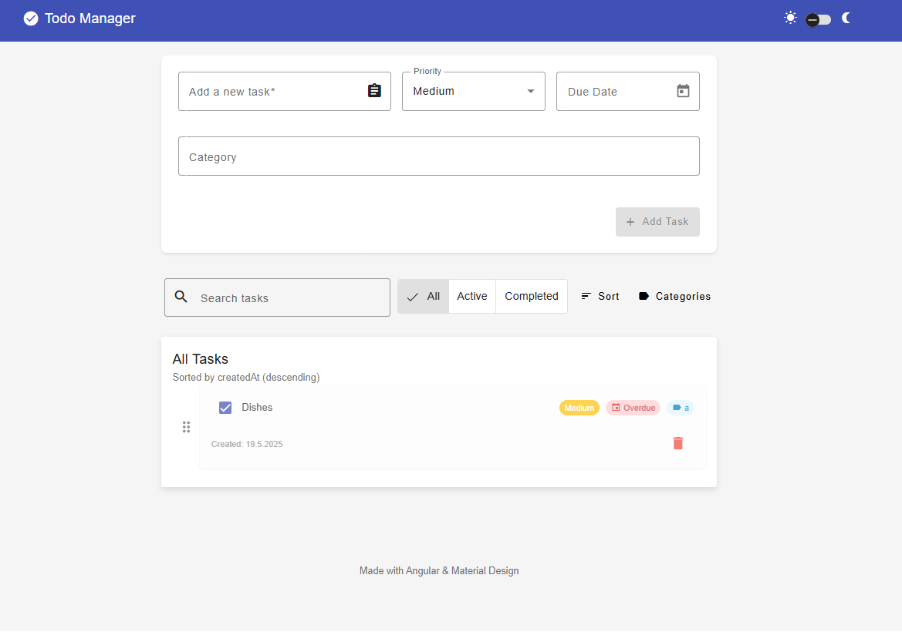
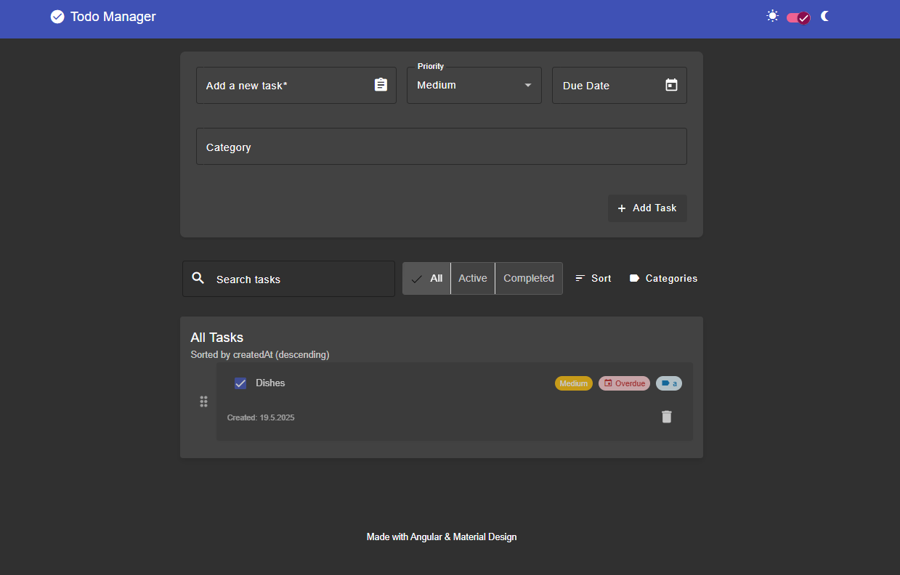

# Todo Manager - Angular Application

A simple and intuitive Todo application built with Angular and Material Design. Manage your tasks efficiently with features like priority, due dates, categories, and drag-and-drop reordering.

## Features

*   **Add, Edit, and Delete Todos:** Easily manage your task list.
*   **Priority Levels:** Assign 'low', 'medium', or 'high' priority to tasks.
*   **Due Dates:** Set due dates for your todos.
*   **Categories:** Organize todos by custom categories.
*   **Filtering:** Filter tasks by status (all, active, completed) and category.
*   **Sorting:** Sort tasks by creation date, title, due date, or priority.
*   **Search:** Quickly find tasks using a search bar.
*   **Drag & Drop Reordering:** Change the order of your tasks with a simple drag and drop.
*   **Dark Mode:** Switch between light and dark themes for comfortable viewing.
*   **Responsive Design:** Works on various screen sizes.
*   **Local Storage:** Todos are saved in the browser's local storage.

##Screenshots




## Getting Started

### Prerequisites

*   Node.js and npm (or yarn) installed.
*   Angular CLI: `npm install -g @angular/cli`

### Installation & Running

1.  **Clone the repository:**
    ```bash
    git clone https://github.com/NicoSchumm/todo-manager.git
    cd todo-manager
    ```
2.  **Install dependencies:**
    ```bash
    npm install
    ```
3.  **Run the development server:**
    ```bash
    ng serve
    ```
    Navigate to `http://localhost:4200/`. The application will automatically reload if you change any of the source files.

## Running Unit Tests

Execute the unit tests via Karma:

```bash
ng test
